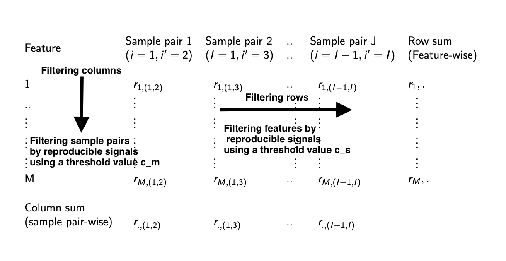

```{r, include=FALSE, echo=FALSE}
# date: "`r doc_date()`"
# "`r pkg_ver('BiocStyle')`"
# <style>
#     pre {
#     white-space: pre !important;
#     overflow-y: scroll !important;
#     height: 50vh !important;
#     }
# </style>
```
---


```{r, echo=FALSE, results="hide", message=FALSE}
require(knitr)
opts_chunk$set(error=FALSE, message=FALSE, warning=FALSE)
```

```{r style, echo=FALSE, results='asis'}
BiocStyle::markdown()
```


# Introduction

Reproducibility is an on-going challenge with high-throughput technologies that
have been developed in the last two decades for quantifying a wide range of
biological processes. One of the main difficulties faced by researchers is the
variability of output across replicate experiments (@li2011measuring). Several
authors have addressed the issue of reproducibility among high-throughput
experiments (@porazinska2010reproducibility, @marioni2008rna,
@ac2013reproducibility). In each high-throughput experiment (e.g., arrays,
sequencing, mass spectrometry), a large number of features are measured
simultaneously, and candidates are often subjected for follow-up statistical
analysis. We use the term features to refer to biological features (e.g.,
metabolites, genes) resulting from a high-throughput experiment in the rest of
this article.  When measurements show consistency across replicate experiments,
we define that measurement to be reproducible. Similarly, measurements that are
not consistent across replicates may be problematic and should be identified. In
this vignette, features that show consistency across high-dimensional replicate
experiments are termed reproducible and the ones that are not consistent are
termed irreproducible.   The reproducibility of a high-throughput experiment
primarily depends on the technical variables, such as run time, technical
replicates, laboratory operators and biological variables, such as healthy and
diseased subjects. A critical step toward making optimal design choices is to
assess how these biological and technical variables affect reproducibility
across replicate experiments (@talloen2010filtering, 
@arvidsson2008quantprime).

In this vignette, we introduce the marr procedure @Philtron2018, referred to as
**maximum rank reproducibility** (**marr**) to identify reproducible features in
high-throughput replicate experiments. In this vignette, we demonstrate with an 
example data set that the (ma)ximum (r)ank (r)eproducibility (marr) procedure
can be adapted to high-throughput MS-Metabolomics experiments across
(biological or technical) replicate samples
(Ghosh et al, 2020, in preparation).

The marr procedure was originally proposed to assess reproducibility of gene
ranks in replicate experiments. The `marr` R-package contains the `Marr()`
function, which calculates  a matrix of signals ($\text{irreproducible}=0$,
$\text{reproducible}=1$) with $M$ rows (total number of features) and $J$
columns ($J={I \choose 2}$) (replicate sample pairs ${I \choose 2}$), where
$J$ is the total possible number of sample pairs of replicate experiments.
We assign feature $m$ to be reproducible if a certain percentage signals
($100c_s\%$) are reproducible for pairwise combinations of replicate
experiments, i.e.,
if $$ \frac{{\sum_{i<i'}{{{r_{m,{(i,i')}}}}}}}{J} >c_s, $$

such that, $c_s \in (0,1)$.

Similarly, we assign a sample pair $(i,~i')$ to be reproducible if a certain
percentage signals ($100c_m\%$) are reproducible across all features, i.e.,
if $$ \frac{\sum_{m}{{r{_{m,(i,i')}}}}}{M}>c_m, $$
such that, $c_s \in (0,1)$.

The reproducible signal matrix is shown in Figure 1 below.
```{r, echo=FALSE, fig.cap="Reproducible Signal matrix", out.width = '100%'}

```
# Getting Started

Load the package in R
```{r load-lib, message=FALSE}
library(marr) 
```

# msprepCOPD Data

The **marr** package contains a pre-processed data `SummarizedExperiment` assay 
object of 645 metabolites (features) measured in plasma and 20 biological
replicates from the multi-center Genetic Epidemiology of COPD (COPDGene) study
which was designed to study the underlying genetic factors of COPD,
(@Regan2010). We only used a subset of the original raw COPD data in this
vignette.

## msprepCOPD data pre-processing

The **msprepCOPD** data  in the **marr** package was pre-processed using the
MSPrep software (@Hughes2013). The data pre-processing include $3$ steps and
they are as follows:
1. `Filtering`: Metabolites are removed if they are missing more
than $80\%$ of the samples, (@Bijlsma2006, @chong2018metaboanalyst).
Originally, there were 662 metabolites in the raw data. After filtering,
645 metabolites remain.
2. `Missing value imputation technique`: We apply Bayesian Principal Component
Analysis (BPCA) to impute missing values (@hastie1999imputing).
3. `Normalization`: Median normalization are performed.

```{r data-1, message=FALSE, warning=FALSE}
data("msprepCOPD")
msprepCOPD
```

# Using the `Marr()` function

## Input for `Marr()`
The `Marr()` function must have one object as input:
1. `object`: a data frame or a matrix or a SummarizedExperiment object with
abundance measurements of metabolites (features) on the rows and replicates
(samples) as the columns. `Marr()` accepts objects which are a data frame or
matrix with observations (e.g. metabolites) on the rows and replicates as the
columns.
2. `pSamplepairs`: **optional** We assign a metabolite (feature) for a replicate
sample pair to be reproducible using a threshold value of `pSamplepairs`
($c_s=0.75$).
3. `pFeatures`: **optional** We assign a sample pair for a metabolite (feature)
to be reproducible using a threshold value of `pFeatures` ($c_m=0.75$).
4. `alpha`: **optional** level of significance to control the False Discovery
rate (FDR). Default is $0.05$ (i.e., $\alpha=0.05$).

## Running `Marr()`

### msprepCOPD SummarizedExperiment example - Evaluating reproducibility

We apply the Marr procedure to assess the reproducibility of replicates in the
msprepCOPD data. The distribution of reproducible pairs and metabolites
(features) are illustrated in Figures 2 and 3, respectively.
To run the `Marr()` function, we only input the data object. We obtain 4 outputs
after running the `Marr()` function. They are shown below:

```{r Marr_output}
library(marr)
Marr_output<- Marr(msprepCOPD, pSamplepairs =
                   0.75, pFeatures = 0.75, alpha=0.05)
Marr_output
## Head of reproducible sample pairs per metabolite (feature)
head(MarrFeatures(Marr_output))
## Head of reproducible metabolites (features) per sample pair
head(MarrSamplepairs(Marr_output))
## Percent of reproducible sample pairs per metabolite (feature)
##greater than 75%
MarrFeaturesfiltered(Marr_output)
## Percent of reproducible metabolites (features) per sample pair
## greater than 75%
MarrSamplepairsfiltered(Marr_output)
```
The distribution of reproducible metabolites/features (sample pairs) per sample
pair (metabolite) can be extracted using the` MarrSamplepairs()` 
(`MarrFeatures()`) function (see above). The distribution of reproducible
metabolites/features  and sample pairs can plotted using the
`MarrPlotSamplepairs()` and `MarrPlotFeatures()` functions, respectively (see
below).

```{r fig.cap="Distribution of reproducible metabolites", plot-Marr-Samplepairs}
MarrPlotSamplepairs(Marr_output) 
```

```{r fig.cap="Distribution of reproducible sample pairs",plot-Marr-Metabolites}
MarrPlotFeatures(Marr_output) 
```

Figure 2 illustrates percentage of
reproducible metabolites (features) per sample pair in the
$x$-axis.  In Figure 2, the higher percentage of reproducible metabolites
(features) per sample pair in the $x$-axis would indicate
stronger reproducibility between the sample pairs.

Figure 3 illustrates percentage of reproducible sample pairs
per metabolite (feature) in the $x$-axis.  In Figure 3, the higher
percentage of reproducible sample pairs per metabolite
(feature) in the $x$-axis would indicate stronger reproducibility
of a metabolite (feature) across all sample pairs.

# Session Info
```{r session-info}
sessionInfo() 
```

# References
